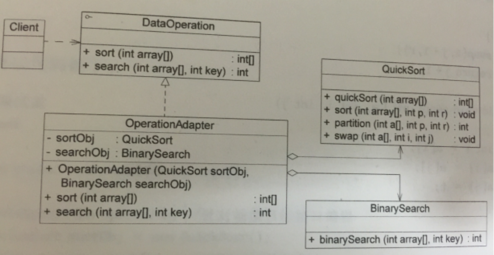
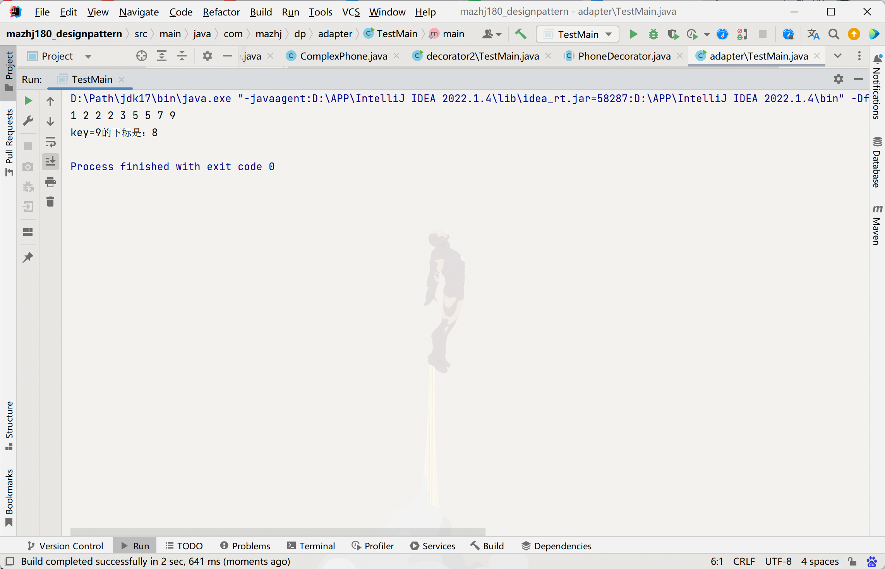

### 适配器模式
>适配器模式，它的功能是将一个类的接口变成客户端所期望的另一种接口，从而使原本因接口不匹配而导致无法在一起工作的两个类能够一起工作。适配器模式分为类适配器模式和对象适配器模式，前者类之间的耦合度比后者高，且要求程序员了解现有组件库中的相关组件的内部结构，所以应用相对较少些。
>
#### 适配器模式（Adapter）包含以下主要角色：
- 目标（Target）接口：当前系统业务所期待的接口，它可以是抽象类或接口。
- 适配者（Adaptee）类：它是被访问和适配的现存组件库中的组件接口。
- 适配器（Adapter）类：它是一个转换器，通过继承或引用适配者的对象，把适配者接口转换成目标接口，让客户按目标接口的格式访问适配者。

#### 实验题
>现有一个接口DataOperation定义了排序方法sort（int [  ]）和查找方法search（int [ ]， int [ ]），已知类QuickSort的quickSort（int [ ]）方法实现了快速排序算法，类BinarySearch 的 binarySearch（int [ ]， int ）方法实现了二分查找算法。现使用适配器模式设计一个系统，在不修改源代码的情况下将类QuickSort和类BinarySearch的方法适配到DataOperation接口中。编程实现。

#### 运行结果

