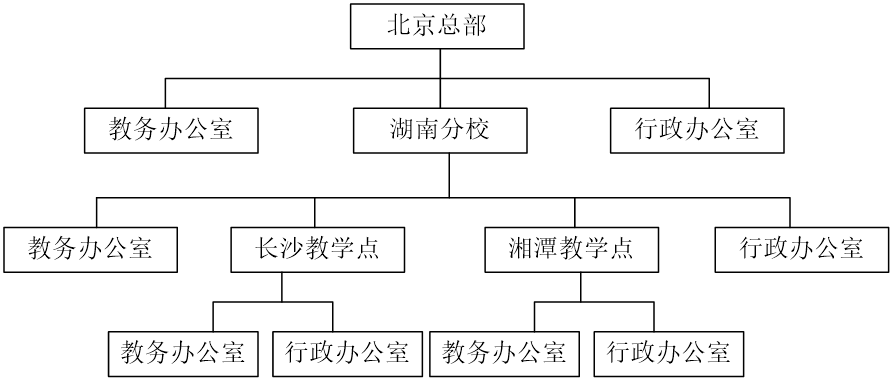

### 组合模式
>组合模式也称为整体-部分（Part-Whole）模式，它的宗旨是通过将单个对象（叶子结点）和组合对象（树枝节点）用相同的接口进行表示。 
> 
>作用：使客户端对单个对象和组合对象保持一致的方式处理。

#### 组合模式主要包含三种角色：
- 抽象根节点（Component）：定义系统各层次对象的共有方法和属性，可以预先定义一些默认行为和属性。
- 树枝节点（Composite）：定义树枝节点的行为，存储子节点，组合树枝节点和叶子节点形成一个树形结构。
- 叶子节点（Leaf）：叶子节点对象，其下再无分支，是系统层次遍历的最小单位。

#### 实验题
>在该教育机构的OA系统中可以给各级办公室下发公文，试采用组合模式设计该机构的组织结构，绘制相应的类图并编程模拟实现，在客户端代码中模拟下发公文。

