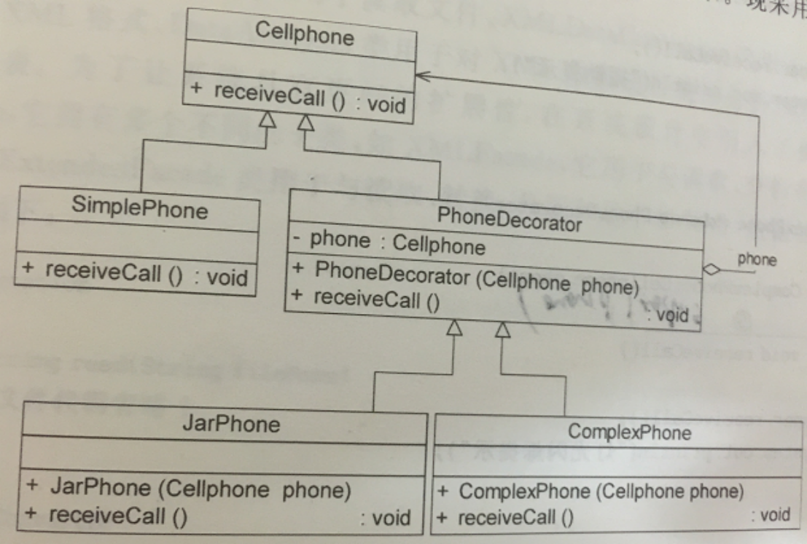
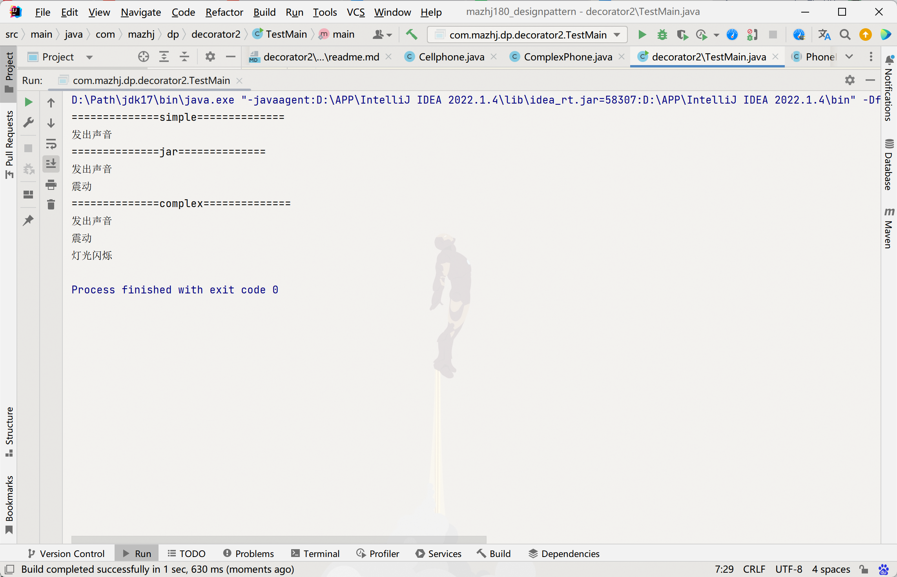

### 装饰模式
>装饰模式，是指在不改变原有对象的基础上，将功能附加到对象上，提供了比继承更有弹性的替代方案（扩展原有对象的功能）

#### 装饰（Decorator）模式中的角色：
- 抽象构件（Component）角色 ：定义一个抽象接口以规范准备接收附加责任的对象。
- 具体构件（Concrete Component）角色 ：实现抽象构件，通过装饰角色为其添加一些职责。
- 抽象装饰（Decorator）角色 ： 继承或实现抽象构件，并包含具体构件的实例，可以通过其子类扩展具体构件的功能。
- 具体装饰（ConcreteDecorator）角色 ：实现抽象装饰的相关方法，并给具体构件对象添加附加的责任。

#### 实验题
>某公司欲开发一套手机来电提示程序，在最简单的版本中，手机在接收到来电时会发出声音来提醒用户；在振动版本中，除了声音外，在来电时手机还能产生振动；在更高级的版本中，手机不仅能够产生发声和产生振动，而且还会有灯光闪烁提示，现采用装饰设计模式来设计，得到如图的类图。

#### 运行结果
